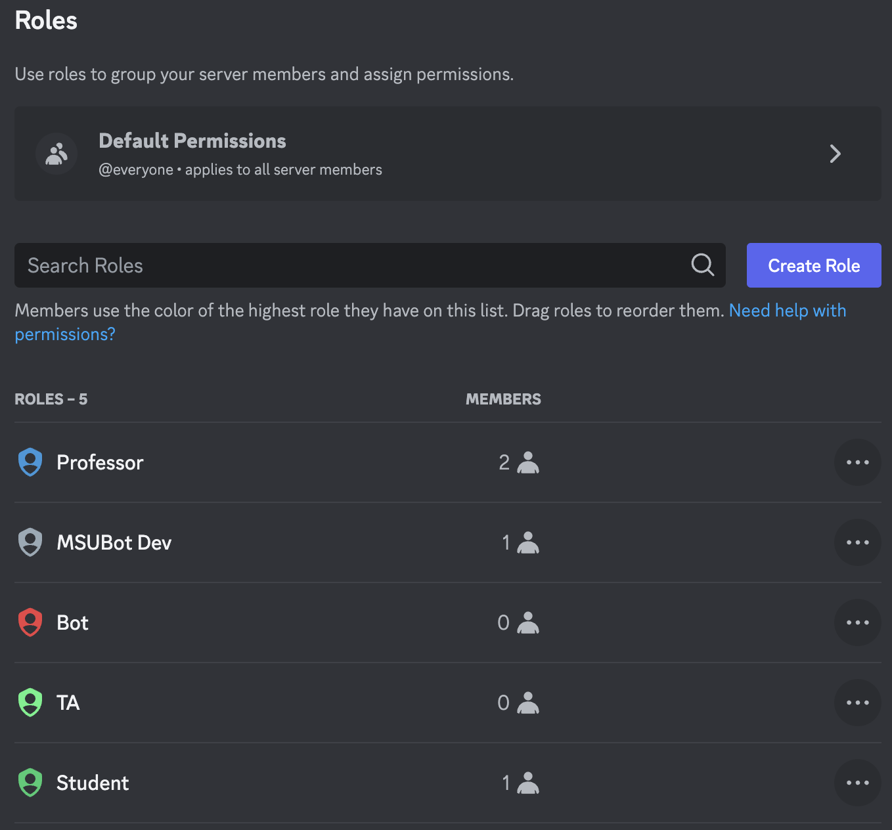

# Setup

## Prerequisites
- Discord account

## Bot Initialization
1. **Create a Discord Server**: The first step is to create a Discord server for your class. There are two options for this:
    - **Use the Template (HIGHLY RECOMMENDED)**: Templates a quick and easy way to set up a Discord server. I created a template specifically for use with this bot that has all of the channels and roles already setup. You can use this template by clicking [here](https://discord.new/W8bpRmDXXEnh), and following the instructions to create a new server for your class.
    - **Create a Server Manually**: If you do not want to use the template, you can create a server manually. You can do this directly in Discord by scrolling to the bottom of your server list, and clicking the "+" button. Then, click the "Create My Own" button, and follow the instructions to create a new server. If you take this route, there will be extra steps you need to take to be able to use all of the bot's features.
2. **Invite the Bot**: Once you have created your server, you will need to invite the bot to your server. You can do this by clicking [here](https://discord.com/api/oauth2/authorize?client_id=1084319907338010774&permissions=8&scope=bot), and following the instructions to invite the bot to your server. You will need to have the "Administrator" permission in order to invite the bot.
3. **Move the Bot's Role**: Once you have invited the bot to your server, you will need to move the bot's role up in the role list. This is necessary to ensure that the bot has the correct permissions to function properly. To do this, go to the "Server Settings" page, and click on the "Roles" tab. Then, click and drag the bot's role directly under the "Professor" role. It should look like the image below:

4. **Setup Class**: Once the bot has been added to the server, you need to setup the class it is associated with. You do this by using the `/setup_class` command. This command will open a modal for you to input all the info about your class.
5. **Enable Wanted Features**: Once you have setup the class, you can enable the features you want to use. This is different for each feature, so see the Features section for more information on how to enable each feature.
6. **Done**: You are now ready to use the bot in your server. See the [Usage](/docs/category/usage) section for more information on how to use the bot.

